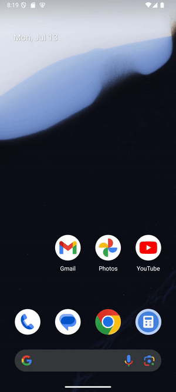
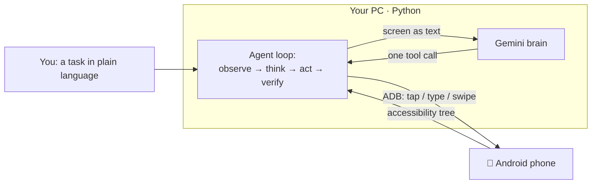

# 📱 Json — an AI agent that operates your Android phone

[](https://github.com/JellowBeanz26/json-android-agent/actions/workflows/ci.yml)
[](LICENSE)

[](https://github.com/astral-sh/ruff)

Json is a personal AI agent that controls a real Android phone (or emulator) from natural-language
instructions. Tell it *"open the calculator and compute 25 × 4"* or *"turn on dark mode"* — it reads
the screen, decides the next action, taps its way to the goal, and then **verifies it actually worked**.

> Built from scratch in Python. The **brain** is Google's Gemini; the **hands** are ADB.
> Nothing is installed on the phone — a program on your PC drives it.

<!-- Record a screen capture of a run and drop it here -->


---

## How it works

Json runs a classic **agent loop**: observe the screen → ask the model for the single next action →
execute it → verify → repeat, until the task is done.



Two design decisions carry the whole project:

1. **Accessibility-tree-first perception.** Instead of screenshots, Json reads the phone's
   *accessibility tree* — a structured list of on-screen elements with their labels and on/off state.
   It's ~10× cheaper in tokens than an image and far more accurate: tap an element by its index,
   don't guess a pixel.
2. **A swappable brain.** The model lives behind one `generate()` interface, so the provider — or a
   future local model — can change without touching the agent logic.

## The hard part: compounding error

The real challenge of a phone agent isn't raw intelligence — it's **compounding error**:

> If each step succeeds 95% of the time, a 15-step task succeeds only **0.95¹⁵ ≈ 46%**.

Json fights this with a reliability spine:

- **Verify after every action** — re-read the screen and confirm the action did what was expected
  (e.g. a toggle now shows `[ON]`).
- **Recover, don't flail** — failures are fed back to the model so it re-plans instead of repeating.
- **A hard step budget**, so a confused run ends cleanly instead of looping forever.
- **Confirm before destructive actions** (send / delete / pay) via an `ask_user` tool.

> ⚠️ And most important: **never trust the agent's own "done" claim.** Success is checked against the
> real device state (e.g. `adb shell cmd uimode night`), not the model's word — because models *do*
> hallucinate success.

## Tools the agent can call

`open_app` · `tap` · `type_text` · `swipe` · `press` (back/home/enter) · `ask_user` · `done`

## Tech stack

- **Python 3.13** — the agent
- **Google Gemini** (`gemini-2.5-flash`) via the `google-genai` SDK — the reasoning brain
- **ADB + uiautomator** — reading the screen and driving the phone
- **Android emulator** for development → real device for deployment

## Project structure

```
device/adb.py     # eyes & hands: read the screen, tap, type, swipe (all via ADB)
llm/gemini.py     # the swappable Gemini brain (with retry/backoff)
agent/tools.py    # tool definitions + the system prompt
agent/loop.py     # the observe → think → act → verify loop
run.py            # chat entry point
config.py         # loads the API key from .env
```

## Running it

```bash
# 1. Install dependencies
pip install google-genai python-dotenv

# 2. Configure your key
cp .env.example .env      # then paste your Gemini API key into .env

# 3. Boot an Android emulator (or plug in a phone with USB debugging enabled)

# 4. Chat with your phone
python run.py
```

Set `JSON_DEBUG=1` to print exactly what the agent "sees" on each step — handy for tuning.

## Known limitations (kept honest on purpose)

- **No screenshot fallback yet** — apps that render an empty accessibility tree (games, some canvases)
  aren't handled.
- **Reliable, not yet minimal** — Json reaches the goal but sometimes takes a few redundant steps.
- **Android only** — programmatic UI control on iOS is locked down by the OS.
- **Bigger model ≠ better here:** on these grounded tasks `gemini-2.5-pro` navigated *worse* than
  `flash` (more flailing, and it once hallucinated success). Small-and-fast won — a lesson worth
  keeping.

## Roadmap

- [x] **v1** — text chat · Gemini brain · ADB control · verified reliability
- [ ] **v2** — voice (local Whisper STT + TTS)
- [ ] **v3** — optional on-device / local-model fallback
- [ ] **the vision** — a standalone on-phone app (Kotlin + AccessibilityService)

---

*A learning project, built step by step — from "is this even possible?" to a working, verified agent.*
